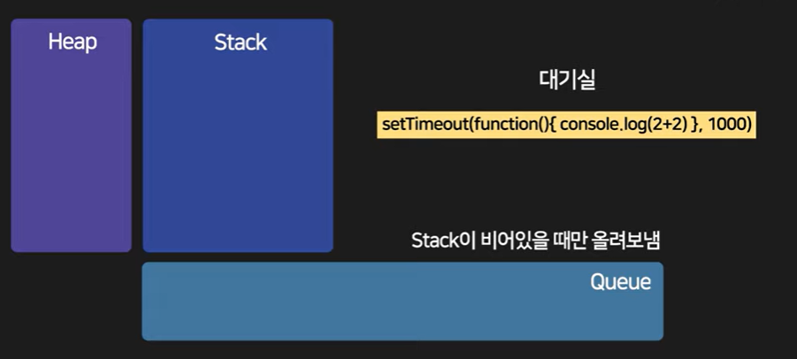

# Web Coup Game
# 브라우저 동작 원리
브라우저는 우리의 프론트 단 소스(html, css, js)를 실행시켜주고 view해준다

브라우저의 동작 원리는 매우 중요하다

```js
console.log(1+1) //1
setTimeout(() => {console.log(2+2)}, 1000) //2
console.log(3+3) //3
```

여기서 실행 순서가 1 > 3 > 2 순으로 실행된다

브라우저는 js를 실행해줄때 절차가 있다

코드에 Stack이라는 저장공간에 저장 되고, Heap에 변수가 저장된다

이때 Stack에 있는 코드는 한 줄씩 실행된다

그리고 setTimeout()이라는 따로 저장한다
Ajax 요청 코드, 이벤트 리스너, setTimeout 등 따로 대기 시키는 공간에 저장한다

Queue라는 저장 공간에 오래걸리는 코드를 두고 필요할 때 Stack에 둔다 이때! Stack이 비어있을 때만 Queue에 있는 코드를 올린다



js는 싱글 스레드 기반이 언어라 비동기적인 행동에 제약이 생긴다
이때 너무 어려운 연산(반복문 1000만번 10초 정도 걸림)을 하면 Stack에 연산이 종료될때 까지 이벤트를 실행할 수 없다

그래서 js를 할때 주의할 사항이다
1. Stack이 바쁘게 하지 마라
2. Queue도 바쁘게 하지 마라

## Thread
## Event
### 이벤트 위임
그럼 JS는 멀티태스킹을 어떻게 함?

💡 이벤트 루프 + 콜백 + 프로미스를 이용한 비동기 처리

그래서 JS는 싱글 스레드지만 멀티스레드처럼 느껴짐.

setTimeout

fetch

이벤트

async/await

이런 비동기 작업들은 실제로 브라우저 엔진의 쓰레드에서 처리됨,
하지만 JS 엔진 자체는 단 하나의 스레드만 사용.